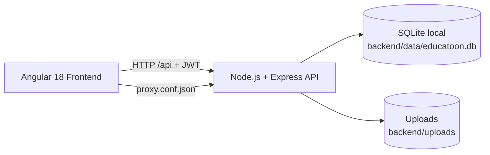

# Reporte técnico de avance para el informe final del proyecto Educatoon Angular + Node.js + SQLite

**Fecha de análisis:** 2026-07-15

**Estado general:** avance funcional en entorno local

Este documento resume el estado actual del proyecto a partir de la lectura del código fuente, manifiestos y configuración del workspace. El alcance es técnico y está orientado a servir como base directa para redactar el informe final. El contenido refleja lo implementado hasta este punto del avance, con una presentación sobria y verificable.

## 0. Resumen visual

| Área | Estado | Comentario |
|---|---|---|
| Frontend | Parcialmente completo | Interfaz principal operativa con workspace central. |
| Backend | Completo para demo | API REST funcional con control por rol. |
| Base de datos | Completa para demo | SQLite local con tablas principales del dominio. |
| Archivos | Completo para demo | Subida y publicación local con Multer. |
| Reportes | Básico | Resumen visual, aún sin analítica avanzada. |
| Despliegue | Pendiente | Proyecto orientado a entorno local. |

> **Nota:** este reporte describe el avance implementado y también deja explícito lo que aún no está cerrado para usarlo luego como base del informe final.

## 1. Objetivo del reporte

El objetivo de este reporte es dejar documentado el estado real del proyecto, identificar qué componentes ya fueron implementados, qué partes están funcionales solo como demo y qué aspectos siguen pendientes para completar el informe final y una eventual versión de producción.

## 2. Alcance y limitaciones

### Alcance

- Revisión del frontend, backend, persistencia y flujos principales.
- Identificación de módulos funcionales y módulos incompletos.
- Resumen de tecnologías, rutas, tablas y relaciones principales.
- Detección de deuda técnica visible en el workspace.

### Limitaciones

- El análisis se basa en el código disponible en el workspace, no en una ejecución completa validada por pruebas.
- No se encontraron scripts de pruebas automatizadas para contrastar comportamiento de extremo a extremo.
- El proyecto está planteado como avance local, por lo que no hay evidencia de despliegue productivo ni observabilidad madura.

## 3. Metodología de revisión

Para construir este reporte se revisaron los archivos raíz del proyecto, los manifiestos de dependencias, la configuración del frontend, el backend principal y las rutas/servicios que conectan ambas capas. También se cruzó la implementación del workspace con las llamadas reales al backend para distinguir lo que está operativo de lo que todavía es una vista parcial o informativa.

## 4. Resumen de avance

El proyecto es una demo local de una plataforma académica llamada Educatoon. La solución está compuesta por un frontend Angular 18, un backend Node.js con Express y una base de datos SQLite local. También incorpora carga de archivos mediante Multer y autenticación basada en JWT.

El sistema está funcional como demo de escritorio/local para gestión académica, con flujos para login, registro de alumnos, aprobación de perfiles, administración de cursos y secciones, matrículas, materiales, tareas, entregas, calificación, foros y asesorías. La mayor parte de la lógica de negocio principal está implementada.

Punto importante para interpretar el documento: esto no describe una versión final de producción, sino un avance técnico que sirve de base para redactar el informe definitivo.

## 5. Tecnologías y componentes detectados

| Componente | Tecnología | Estado |
|---|---|---|
| Frontend | Angular 18 | Implementado |
| Backend | Node.js + Express | Implementado |
| Base de datos | SQLite | Implementado |
| Autenticación | JWT | Implementado |
| Hash de contraseñas | bcryptjs | Implementado |
| Carga de archivos | Multer | Implementado |
| Logging HTTP | Morgan | Implementado |
| CORS | cors | Implementado |
| Build frontend | Angular CLI | Implementado |

## 6. Estructura funcional del avance

### Frontend

- Inicio en login.
- Registro de alumnos.
- Workspace único con navegación por módulos.
- Guard e interceptor para sesión y autenticación.

### Backend

- API REST centralizada.
- Autenticación por JWT.
- Control de acceso por rol y por pertenencia a sección o asesoría.
- Endpoints para usuarios, perfiles, cursos, secciones, materiales, tareas, entregas, foros y asesorías.

### Base de datos

- Persistencia local en SQLite.
- Tablas para identidad, cursos, secciones, tareas, entregas, materiales, mensajes, reuniones, evaluaciones y asesorías.

### Archivos

- Almacenamiento local en `backend/uploads`.
- Descarga pública controlada mediante rutas servidas por el backend.

## 7. Arquitectura general



### Capas identificadas

- Frontend: Angular 18 con rutas, guard de autenticación e interceptor HTTP.
- Backend: Node.js con Express, CORS, Morgan, JWT, BCrypt y Multer.
- Persistencia: SQLite local en archivo.
- Archivos: subida y descarga desde carpeta local de uploads.

## 8. Estado del frontend

### Estructura y arranque

- Entrada principal en [frontend/src/main.ts](frontend/src/main.ts).
- Rutas declaradas en [frontend/src/app/app.routes.ts](frontend/src/app/app.routes.ts).
- La navegación inicial redirige a login.
- La vista principal protegida está en `/app`.

### Autenticación y sesión

- El login guarda token y usuario en `sessionStorage`.
- El interceptor agrega `Authorization: Bearer <token>` a cada request.
- El guard bloquea acceso a `/app` si no hay sesión activa.
- El flujo de logout limpia sesión.

### Interfaz funcional observada

El workspace principal concentra la aplicación operativa y cubre:

- Dashboard con indicadores rápidos.
- Calendario académico semanal.
- Catálogo de cursos.
- Gestión de secciones.
- Matrículas y aprobación de perfiles.
- Administración de usuarios.
- Asesorías académicas.
- Reportes resumidos.
- Configuración institucional.
- Perfil del usuario.
- Contenido por semanas.
- Tareas, entregas y calificaciones.
- Foro por canal de sección.

### Estado funcional del front

| Área | Estado | Observación |
|---|---|---|
| Login | Implementado | Redirige al workspace tras autenticación. |
| Registro | Implementado | Registra alumnos en estado pendiente. |
| Workspace | Implementado | Consolida casi toda la operación del sistema. |
| Foros/canales | Implementado | Mensajería por sección con control por acceso. |
| Tareas y notas | Implementado | Docente crea, alumno entrega y docente califica. |
| Asesorías | Implementado | Incluye detalle, mensajes y materiales. |
| Reportes | Parcial | Solo indicadores resumidos y texto de observabilidad. |
| Configuración | Parcial | Es una vista informativa, no un panel persistente. |
| Perfil | Implementado | Permite editar datos personales. |

## 9. Estado del backend

### Tecnología y arranque

- Entrada principal en [backend/src/server.js](backend/src/server.js).
- Persistencia y utilidades SQLite en [backend/src/db.js](backend/src/db.js).
- El servidor escucha en el puerto `3000` por defecto.
- Hay modo de reinicio de base de datos con `--reset`.

### Dependencias observadas

- Express para API REST.
- Cors para permitir llamadas desde el frontend local.
- Morgan para logging HTTP.
- JWT para autenticación.
- BCrypt para hash de contraseñas.
- Multer para carga de archivos.
- SQLite3 para persistencia local.

### Seguridad y acceso

- Autenticación con JWT de 8 horas.
- Control de permisos por rol.
- Roles presentes: ALUMNO, DOCENTE, COORDINADOR, ADMINISTRADOR.
- Validación de acceso por sección y por asesoría.
- El login exige cuentas con estado APROBADO.

### Endpoints principales detectados

#### Salud y autenticación

- `GET /api/health`
- `POST /api/auth/login`
- `POST /api/auth/register`
- `GET /api/auth/me`
- `PUT /api/me/perfil`

#### Bootstrap y navegación de datos

- `GET /api/bootstrap`
- `GET /api/secciones/:id/canales`
- `GET /api/canales/:id/mensajes`
- `POST /api/canales/:id/mensajes`

#### Administración de usuarios y perfiles

- `POST /api/usuarios`
- `PUT /api/usuarios/:id`
- `DELETE /api/usuarios/:id`
- `GET /api/usuarios/:id/detalle`
- `GET /api/perfiles`
- `PUT /api/perfiles/:usuarioId/aprobar`

#### Cursos, secciones y matrículas

- `POST /api/cursos`
- `POST /api/secciones`
- `POST /api/secciones/:id/matriculas`
- `GET /api/docentes`
- `GET /api/alumnos`

#### Materiales, tareas y evaluación

- `POST /api/materiales`
- `POST /api/tareas`
- `POST /api/tareas/:id/entregas`
- `PUT /api/entregas/:id/calificar`

#### Asesorías

- `GET /api/asesorias/:id`
- `POST /api/asesorias`
- `PUT /api/asesorias/:id`
- `POST /api/asesorias/:id/mensajes`
- `POST /api/asesorias/:id/materiales`

### Observación técnica del backend

El backend está bastante completo para una demo local. La lógica de autorización está centralizada y el API devuelve vistas consolidadas para el frontend mediante `/api/bootstrap`, lo que reduce la cantidad de llamadas separadas desde Angular. En otras palabras, el backend ya soporta el flujo funcional principal del avance, aunque todavía no es un producto listo para despliegue formal.

## 10. Datos y persistencia

### Archivo de base de datos

- Base SQLite: [backend/data/educatoon.db](backend/data/educatoon.db)

### Tablas principales identificadas

- roles
- usuarios
- perfiles
- cursos
- secciones
- matriculas
- canales
- mensajes
- materiales
- tareas
- entregas_tarea
- reuniones
- evaluaciones
- progreso_academico
- asesorias
- asesorias_mensajes
- asesorias_materiales

### Modelo funcional resumido

- Un usuario tiene un rol y un perfil.
- Un curso puede tener varias secciones.
- Una sección puede tener docente, alumnos matriculados, canales, materiales y tareas.
- Una tarea puede recibir una entrega por alumno.
- Una entrega puede ser calificada con nota y retroalimentación.
- Una asesoría tiene mensajes y materiales asociados.

## 11. Integración frontend-backend

### Comunicación local

- El frontend usa proxy local hacia `http://localhost:3000` en [frontend/proxy.conf.json](frontend/proxy.conf.json).
- El frontend consume la API por rutas relativas `/api/...`.
- Los archivos cargados se sirven desde `/uploads`.

### Flujo de sesión

1. El usuario inicia sesión.
2. El backend valida credenciales y estado del perfil.
3. El backend entrega token JWT y datos básicos del usuario.
4. El frontend guarda token y perfil en `sessionStorage`.
5. El interceptor agrega el token en las peticiones posteriores.

## 12. Funcionalidades implementadas

### Para alumno

- Registro de solicitud.
- Login.
- Visualización de cursos y secciones.
- Consulta de materiales por semana.
- Entrega de tareas.
- Consulta de notas y retroalimentación.
- Participación en foros de sección.
- Edición de datos de perfil.

### Para docente

- Visualización de secciones asignadas.
- Carga de materiales por semana.
- Creación de tareas con archivo opcional.
- Revisión de entregas.
- Registro manual de notas y retroalimentación.
- Seguimiento de asesorías.
- Participación en foros.

### Para coordinador y administrador

- Aprobación de perfiles.
- Creación de cursos.
- Creación de secciones.
- Asignación de docentes.
- Matrícula de alumnos.
- Gestión de usuarios.
- Gestión de asesorías.
- Acceso a reportes resumidos.

## 13. Lo que falta o está pendiente

### Pendientes funcionales observados

- El módulo de reportes todavía es básico; muestra indicadores simples, pero no exporta archivos ni presenta analítica avanzada.
- El panel de configuración es informativo, no un sistema real de parámetros persistidos.
- No se observan métricas, trazabilidad de eventos ni observabilidad técnica conectada.
- No hay evidencia de integración con servicios externos de correo, mensajería o almacenamiento cloud.
- No se detectaron scripts de pruebas automatizadas en los `package.json` revisados.

### Deuda técnica

- El frontend presenta advertencias de TypeScript en [frontend/tsconfig.json](frontend/tsconfig.json): opciones deprecadas como `baseUrl`, `downlevelIteration` y `moduleResolution`, además de una observación de `rootDir`.
- La sesión del frontend depende de `sessionStorage` y del estado interno de la app; no se ve una restauración completa de sesión al recargar.
- La solución está pensada para entorno local; no se aprecia infraestructura de despliegue, CI/CD ni configuración cloud en este workspace.

### Riesgos de mantenimiento

- El workspace principal concentra mucha lógica de negocio en un solo componente grande.
- El crecimiento futuro puede dificultar mantenimiento si no se fragmenta por módulos o dominios.
- Hay una mezcla de vistas operativas y paneles informativos dentro del mismo archivo de workspace.

## 14. Conclusiones preliminares

La aplicación está en estado funcional para demostración local y cubre el ciclo académico principal. El stack está bien alineado para una demo interna, pero todavía faltan componentes de nivel productivo: pruebas automatizadas, observabilidad, configuración real del sistema, despliegue y limpieza de deuda técnica de TypeScript.

En términos de presentación, este reporte deja visible el avance real del proyecto y también una lectura clara de su arquitectura actual, aunque el producto aún no sea una versión final de producción. Esto lo convierte en una base útil para redactar el informe definitivo.

## 15. Recomendaciones para el informe final

- Resumir el proyecto como una plataforma académica local en fase de avance funcional.
- Destacar que el backend y el modelo de datos ya soportan el flujo principal del negocio.
- Aclarar que reportes, configuración y observabilidad siguen en nivel básico.
- Mencionar la deuda técnica de TypeScript y la ausencia de pruebas automatizadas como puntos pendientes.
- Presentar el sistema como demo local, no como despliegue productivo cerrado.

## 16. Comandos de ejecución documentados

```bash
npm install
npm run install:all
npm run dev
```

La aplicación se abre en:

```text
http://localhost:4200
```

Para reiniciar la base local:

```bash
npm run reset:db
```
